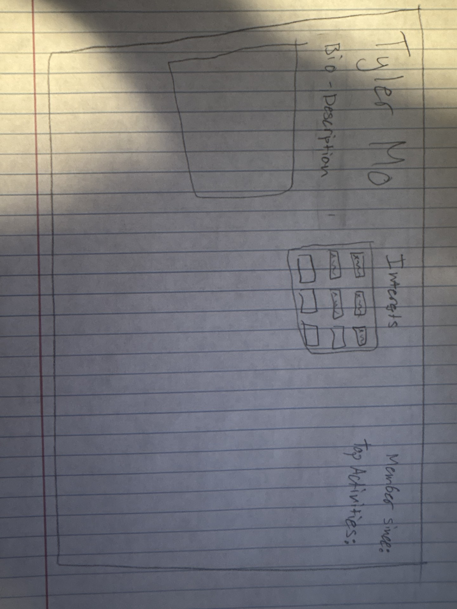
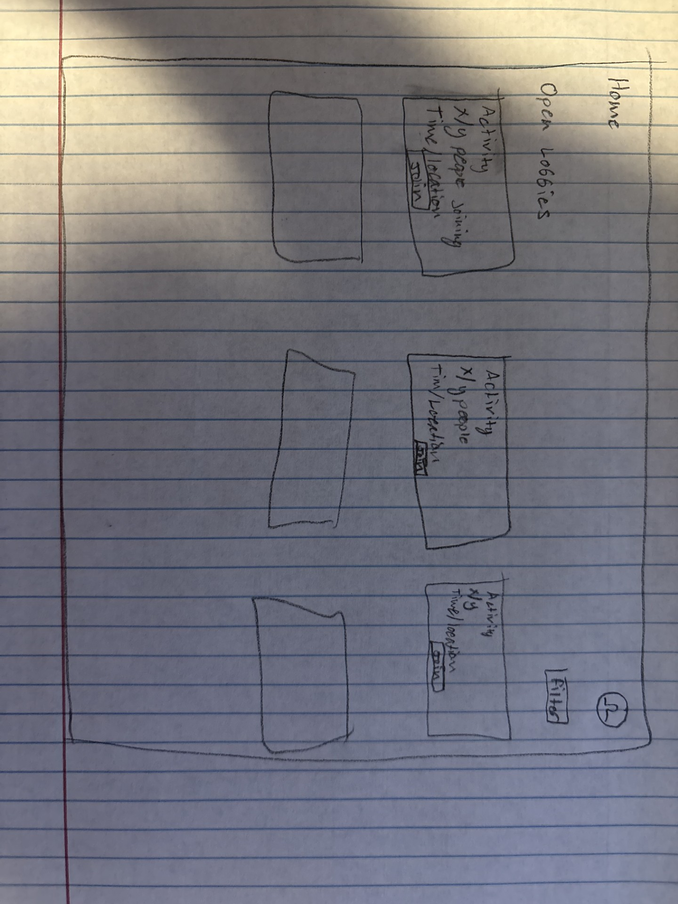
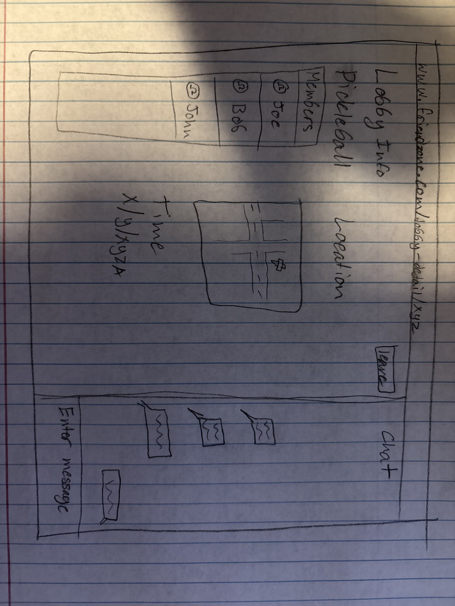

# Kynectra

[My Notes](notes.md)

The Friendzone is a platform for students to meet new friends through activity lobbies, chat, and profiles. It helps drive connection between people by providing safe activities that members can attend, helping create new connections between people on college campus's!

## 🚀 Specification Deliverable

> [!NOTE]
>  Fill in this sections as the submission artifact for this deliverable. You can refer to this [example](https://github.com/webprogramming260/startup-example/blob/main/README.md) for inspiration.

For this deliverable I did the following. I checked the box `[x]` and added a description for things I completed.

- [x] Proper use of Markdown
- [x] A concise and compelling elevator pitch
- [x] Description of key features
- [x] Description of how you will use each technology
- [x] One or more rough sketches of your application. Images must be embedded in this file using Markdown image references.

### Elevator pitch

Friendzone is the ultimate place for meeting and making new friends. Friendzone is a free platform that allows you to connect and meet others through various different activities! Through the use of lobbies, it allows anyone in the area to join in on activities, setting a low pressure time, and activity for people to join in! Through the use of online chats as well, users can coordinate and go above and beyond what the base lobby system offers, bringing people together!

### Design
#### Login Page

This will be the main landing page. From here this is how users sign up for an account, or if already users, sign in! We will have options to sign in with google or outlook by using OAuth, allowing more options for users to sign up with. 

#### Lobby Select Page

This will the main sign in page where users can sign up and find activities to do with others! From here lobbies will popup in individual cards where you can see light details about them, and you can have the options to filter through to find events relavant to you. You can join and view in depth activites from this page. 

#### Lobby Detail Page

This is the in depth page where you can view specific event details including but not limited to: Event name, description, location, time, members attending. From here you can also chat with others attending to pre arrange if needed and to get to know people before you show up!

#### Profile Page

This is your personal profile, others can view and learn about what you like. This page will be similar to most social media personal profile pages. 

### Key features

- Lobbies
    - Activity
    - Description
    - Location
    - Start/End Time
    - Lobby available chats
    - Lists of users who plan on going to an activity
- Lobby Discovery Page
- Basic Profile Page
- Direct messaging

### Technologies

I am going to use the required technologies in the following ways.

- **HTML** - This will be the skeleton of the website, this is the technology that holds what words are displayed and what content is displayed on each page.
- **CSS** - CSS is used for styling the page! CSS will allow me to create an aesthetically pleasing website, attracting users to our website and helping them stay with frictionless experience.
- **React** - React is a tool that helps me as a developer create the website faster. It comes with features that allow me to style and use individual components of one portion of the website, in others, speeding up development time and helping keep the frontend organized. React will also allow the users to navigate around the website, getting from one page to another.  
- **Service** - This is the component of our website that makes it work! Through the use of oAuth I can allow users the flexibility of logging in with different accounts, such as with a google account, while still being able to customize their experience while on my website. This is also what serves content, bridging the gap between things such as what users see and what is stored, and what other users may contribute to the website! For my website specifically there will be dynamically created routes for each of the different lobbies, there will be individual profile website routes, and routes that allow users to login and authenticate themselves. 
- **DB/Login** - This is where we will store user information. This is what allows the website to save information about users, such as their name, their chat history, their preferences, any and all information is stored in the database. With logins it allows us to create a more custom and personalized experience for each user, and what seperates one person between another. It will function primarily as an idenifier, with the option to creating a recomendation system to keep users engaged and serve them content that is tuned to what they want to go do. 
- **WebSocket** - Online chats and finding activities will be a major part of this website, and through the use of WebSockets it allows the website to communicate live information directly to the user in real time. Within the world of chats this prevents the need to refresh the page to see if new messages were sent, it allows us to update the status of lobbies in real time, and allows users to see if others are online in real time!

## 🚀 AWS deliverable

For this deliverable I did the following. I checked the box `[x]` and added a description for things I completed.

- [ ] **Server deployed and accessible with custom domain name** - [My server link](https://yourdomainnamehere.click).

## 🚀 HTML deliverable

For this deliverable I did the following. I checked the box `[x]` and added a description for things I completed.

- [x] **HTML pages** - I created: dashboard.html, index.html, lobbyInfo.html, login.html, ProfileSkeleton.html pages. These are the main html pages I will need for my website.
- [x] **Proper HTML element usage** - I used HTML elements properly to create the structure of each page.
- [x] **Links** - I linked my github, as well as links to navigate to each of the different pages.
- [x] **Text** - Most of my web pages are skeleton web pages, where text and information will be added dynamically via JS. Currently in place are placeholder text, or containers to which content will be added into.
- [x] **3rd party API placeholder** - Within the login page, a clear section was created to be a placeholder for where I will incooporate a 3rd party API.
- [x] **Images** - I used a placeholder profile image within the profile skeleton html document.
- [x] **Login placeholder** - I created a login.html page, that is a placeholder/skeleton of which I will create the login page on.
- [x] **DB data placeholder** - I used filler data for a few of the web pages with example text to immitate what might come from my database.
- [x] **WebSocket placeholder** - Within the lobby info page its going to use a chat, this is how websockets will be used within my website and incooporated.

## 🚀 CSS deliverable

Color Theme: #328aaa - Background   #194555 - Cards and Boxs   #4bcfff - Titles and such

For this deliverable I did the following. I checked the box `[x]` and added a description for things I completed.

- [X] **Header, footer, and main content body** - Styled the header, main, and footer portions
- [X] **Navigation elements** - Nav bar has been created and styled!
- [X] **Responsive to window resizing** - Smaller devices will get a differenent nav bar layout!
- [X] **Application elements** - Elements are all styled!
- [X] **Application text content** - Styled the text!
- [X] **Application images** - Images have been resized to appropriate sizes and placed roughly where they need to be!

## 🚀 React part 1: Routing deliverable

For this deliverable I did the following. I checked the box `[x]` and added a description for things I completed.

- [X] **Bundled using Vite** - 
- [X] **Components** - 
- [X] **Router** - 

## 🚀 React part 2: Reactivity deliverable

For this deliverable I did the following. I checked the box `[x]` and added a description for things I completed.

- [X] **All functionality implemented or mocked out** - like 99% of the actual functionality relies on a working database and users... I was able to implement a "pretend" backend using WSX (what a nightmare)
- [X] **Hooks** - 

## 🚀 Service deliverable

For this deliverable I did the following. I checked the box `[x]` and added a description for things I completed.

- [X] **Node.js/Express HTTP service** - all the backend stuff should be fully working! Lot of it was able to be copy pasted over from MSW stuff I had. 
- [X] **Static middleware for frontend** - not too much to say, i got this. Uses the public directory. 
- [X] **Calls to third party endpoints** - HEY! Soooo i used a joke api for each lobby when its created. I'll make a comment but whats your email? For google auth i need peoples gmails to allow them into the app because it'll be in a "dev" state. If that counts for API i can replace the joke and add in the google stuff, since i've done it before with a different project pretty fast. 
- [X] **Backend service endpoints** - Are all exposed to people if they're logged in so you can fill in all the skeletons of everything. 
- [X] **Frontend calls service endpoints** - frontend is able to call the backend. Has to call it a lot to be able to fetch all the data stored in memory for now to populate all the lobbies and profiles and such. 
- [X] **Supports registration, login, logout, and restricted endpoint** - yeah, create account, logout, cookies, shouldn't be able to just /dashboard everything. 

## 🚀 DB deliverable

For this deliverable I did the following. I checked the box `[x]` and added a description for things I completed.

- [X] **Stores data in MongoDB** - able to store lobby info and such
- [X] **Stores credentials in MongoDB** - able to track users 

## 🚀 WebSocket deliverable

For this deliverable I did the following. I checked the box `[x]` and added a description for things I completed.

- [X] **Backend listens for WebSocket connection** - Yeah backend listens for a websocket connection
- [X] **Frontend makes WebSocket connection** - Uhh yeah same here, the frontend makes a websocket connection. Uhh yeah
- [X] **Data sent over WebSocket connection** - chat data is sent to other people immediately
- [X] **WebSocket data displayed** - chat data is displayed
- [X] **Application is fully functional** - Yeah application should be fully functional!